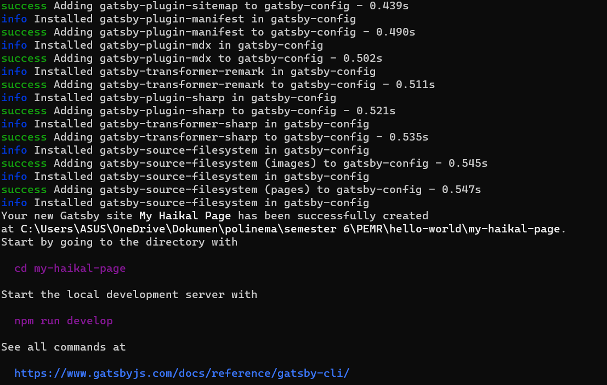

This is a [Next.js](https://nextjs.org/) project bootstrapped with [`create-next-app`](https://github.com/vercel/next.js/tree/canary/packages/create-next-app).

## Getting Started

First, run the development server:

```bash
npm run dev
# or
yarn dev
# or
pnpm dev
# or
bun dev
```

Open [http://localhost:3000](http://localhost:3000) with your browser to see the result.

You can start editing the page by modifying `app/page.tsx`. The page auto-updates as you edit the file.

This project uses [`next/font`](https://nextjs.org/docs/basic-features/font-optimization) to automatically optimize and load Inter, a custom Google Font.

## Laporan Praktikum

|  | Pemrograman Berbasis Framework 2024 |
|--|--|
| NIM |  2141720080 |
| Nama |  Muhammad Haikal Buldan |
| Kelas | TI - 3A |


### Jawaban Soal 1

Dalam konteks proses `npx create-next-app`, berikut adalah jawabannya:

1. **TypeScript** – Bahasa pemrograman statis yang memungkinkan pengguna untuk menuliskan kode JavaScript dengan fitur tipe data lebih canggih dan kekuatan lainnya.

2. **ESLint** – Alat otomatisasi pengecekan kualitas kode yang digunakan untuk melakukan validasi terhadap standar atau stil guide (style guides) yang telah ditentukan.

3. **Tailwind CSS** – Framework CSS modern yang memberikan klasifikator berdasarkan fungsionalitas sehingga pengguna tidak perlu menyebut secara eksplisit nama class CSS dalam setiap elemen HTML.

4. **App Router** – Sistem routing yang disediakan oleh Next.js untuk membuat aplikasi web reaktif dengan rute dinamis dan struktur navigasi yang fleksibel.

5. **Import alias** – Fitur di bawa oleh ESLint dan beberapa alat lainnya yang memungkinkan pengguna untuk merubah nama file import secara global agar lebih ringkas dan mudah dipahami.

Dalam konteks proses `npx create-remix`, berikut adalah jawabannya:


1. **Remix** - Remix adalah sebuah framework web yang digunakan untuk membangun aplikasi web modern dengan menggunakan teknologi terbaru seperti React, TypeScript, dan lain-lain. Framework ini memungkinkan pengembang untuk membuat aplikasi web yang cepat, aman, dan mudah dikembangkan.

2. **dir** - `dir` adalah opsi yang digunakan untuk menentukan direktori tempat proyek Remix akan disimpan. Opsi ini dapat digunakan dengan menambahkan argumen setelah perintah `npx create-remix`. Contohnya, `npx create-remix my-app --dir=my-project` akan membuat proyek baru dengan nama `my-app` dan menyimpannya di dalam direktori `my-project`.

3. **git** - Git adalah sebuah sistem kontrol versi yang digunakan untuk mengelola perubahan pada kode sumber. Git memungkinkan pengembang untuk bekerja secara kolaboratif pada proyek yang sama dan melacak perubahan yang terjadi pada kode sumber. Opsi `--git` pada perintah `npx create-remix` akan menginisialisasi proyek baru dengan Git dan membuat commit pertama.

4. **deps** - `deps` adalah opsi yang digunakan untuk menentukan package manager yang akan digunakan untuk mengelola dependensi proyek. Opsi ini dapat digunakan dengan menambahkan argumen setelah perintah `npx create-remix`. Contohnya, `npx create-remix my-app --deps=yarn` akan membuat proyek baru dengan nama `my-app` dan menggunakan Yarn sebagai package manager untuk mengelola dependensi proyek.

Dalam konteks proses `npx create-gatsby`, berikut adalah jawabannya:



### Jawaban Soal 2

1. **.git** - Folder ini berfungsi sebagai repository Git yang digunakan untuk manajemen kontrol versi dari proyek React. Folder ini tidak akan terlihat jika proyek belum didedikasikan ke dalam sistem kontrol versi Git.

2. **node_modules** - Folder ini berisi semua dependensi atau paket yang dibutuhkan oleh proyek React. Folder ini dihasilkan secara otomatis setelah menjalankan perintah `npm install` atau `yarn install`.

3. **public** - Folder ini berisi file statis seperti gambar, ikon, dan file HTML yang akan digunakan oleh aplikasi React. File HTML yang terdapat di dalam folder ini akan menjadi template dasar untuk aplikasi React.

4. **src** - Folder ini berisi kode sumber atau source code dari aplikasi React. Berikut adalah penjelasan dari setiap file dan folder yang terdapat di dalam folder `src`:

    ...(saya sudah menjelaskannya di pertanyaan sebelumnya)...

5. **.eslintrc.json** - File ini berisi konfigurasi ESLint yang digunakan untuk melakukan validasi terhadap standar atau stil guide (style guides) yang telah ditentukan.

6. **gitignore** - File ini berisi daftar file atau directory yang tidak harus masuk ke dalam sistem kontrol versi Git. Contohnya, file log atau database yang tidak diperlukan diversi control.

7. **next.config.mjs** - File ini berisi konfigurasi tambahan untuk framework Next.js jika proyek menggunakan Next.js. Misalnya, konfigurasi routing, optimasi build, dan lain-lain.

8. **next-env.d.ts** - File ini berfungsi sebagai file type declaration untuk environment variables yang digunakan dalam proyek Next.js.

9. **package.json** - File ini berisi informasi tentang proyek React, seperti nama proyek, versi, dependensi, dan skrip yang dapat dijalankan.

10. **package-lock.json** - File ini berisi informasi tentang dependensi yang digunakan oleh proyek React. File ini digunakan untuk memastikan bahwa dependensi yang digunakan oleh proyek React selalu konsisten dan tidak berubah-ubah.

11. **postcss.config.js** - File ini berisi konfigurasi PostCSS yang digunakan untuk melakukan transformasi CSS seperti minify, autoprefixer, dan lain-lain.

12. **README.md** - File ini berisi dokumentasi tentang proyek React, seperti cara menginstal, menjalankan, dan mengembangkan proyek React. File ini juga dapat digunakan untuk memberikan informasi tambahan tentang proyek React.

13. **tailwind.config.ts** - File ini berisi konfigurasi Tailwind CSS yang digunakan untuk melakukan style-ning dalam proyek React.

14. **tsconfig.json** - File ini berisi konfigurasi TypeScript yang digunakan untuk melakukan compile TypeScript menjadi JavaScript. Konfigurasi ini termasuk pilihan compiler, tipe checker, dan lain-lain.

### Jawaban Soal 3


Perubahan pada file `src/app/page.tsx` langsung terlihat di browser tanpa memerlukan perintah `npm run dev` atau me-reload halaman karena kemungkinan proyek ini menggunakan hot module replacement (HMR). Fitur ini memungkinkan kode baru yang dikompilasi secara dinamis dimuat langsung ke dalam aplikasi tanpa perlu restart, sehingga perubahan dapat langsung terlihat oleh pengembang, meningkatkan produktivitas mereka.